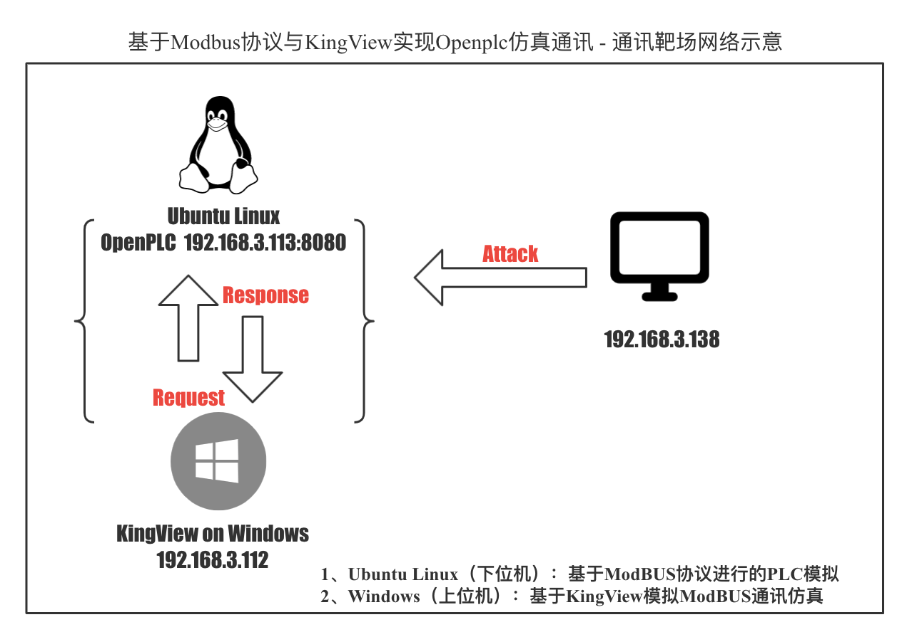
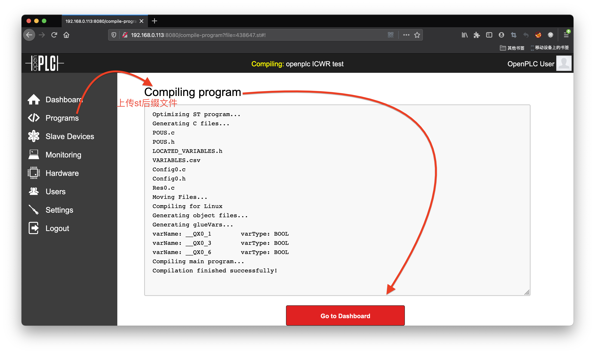
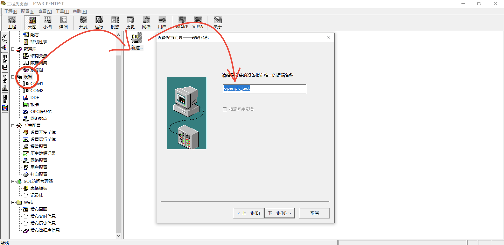
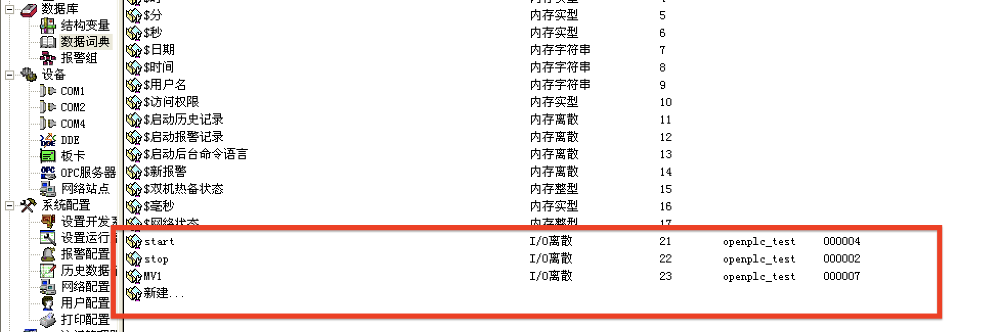

# *Industrial Control Wiki Record* 

## 五：常见工业协议解读


### 5x01 工业协议分析

#### WAIT PLZ...

### 5x02 《基于*Modbus*协议与*KingView*实现*Openplc*仿真通讯（1）- 仿真通讯靶场搭建》

- 基于Modbus协议与KingView实现Openplc仿真通讯 - 通讯靶场网络示意图如下



#### # *OpenPLC on Linux*

- *OpenPLC*环境搭建
	- [*点击以了解OpenPLC*](https://github.com/thiagoralves/OpenPLC_v3)

```
$ mkdir ICWR && cd ICWR
$ git clone https://github.com/thiagoralves/OpenPLC_v3.git
openplc_test.st
$ cd OpenPLC_v3
$ ./install.sh linux
···
···
···
Compiling for Linux
Generating object files...
Generating glueVars...
Compiling main program...
Compilation finished successfully!
```

运行：`nohup ./start_openplc.sh &`

- *OpenPLC_Editor on Linux*

**作用为本地PLC程序调试使用，无需求可跳过**

```
$ git clone https://github.com/thiagoralves/OpenPLC_Editor.git
$ cd OpenPLC_Editor
$ ./install.sh
$ ./openplc_editor.sh
```

#### # *OpenPLC Programs*




#### # *Kingview on Windows*

- 设备驱动 -> PLC -> 莫迪康 -> ModBUS TCP -> TCP -> 下一步：



- 文件 -> 画面 添加组件（可参考动图添加组件）

- 数据库 -> 数据字典 -> 新建...
	- 

选中自定义画面 -> make -> view ：


### 工控常见端口、服务以及协议

常见的渗透中的利用端口如21、22端口，在我看来，均没有必要花大量时间去探测服务，应当将更多时间来针对个性化端口上的突破；

- 而由于第一章谈到的不同厂商之间通讯硬件、协议之间的差距，我们应做到的是对于常见端口的熟悉：

	- _表5-1 工控常见PLC通讯端口_

 常见端口号  |  协议 | 代表产品 | 厂商
 -----------|-----------|----------------------|-----------
 TCP/44818	| Ethernet/IP | Control Logix | AB 罗克韦尔
 TCP/44818	| Ethernet/IP | Compact Logix | AB 罗克韦尔
 TCP/44818	| Ethernet/IP | - 				| OPTO 22 奥普图
 TCP/44818	| Ethernet/IP | CJ2				| OMRON 欧姆龙
 TCP/18245	| GE SRTP	  | RX3i			| GE通用电气
 TCP/5007	| MELSOFT Protocol | Q series 		| ME 三菱电机
 UDP/5006	| MELSOFT Protocol | - 				| -
 TCP/2001	| OPTO 22 Ethernet | - 				| -
 UDP/9600	| OMRON FINS
 TCP/1962	| -			  | Inlines series      | 菲尼克斯
 TCP/20547	| - 		  | - 					| -
 TCP/502	| Modbus/TCP  | Quantum				| 施耐德
 TCP/102	| ISO-TSAP	  | s7 series			| Siemens西门子

 文件共享服务、连接服务、WEB应用服务等可以参考以下链接，和WEB渗透中常见端口基本一致。
 - [*点击以了解文件共享服务、连接服务、WEB应用服务常用端口及利用方式*](https://www.yuque.com/tidesec/ics/dca86987e7f1058d4a30fc5813cb2f2d#469c29e8)

## 参考

- [OpenPLC : CREATING YOUR FIRST PROJECT](https://www.openplcproject.com/reference/basics/first-project.html)
- [工控系统常见安全威胁](https://www.yuque.com/tidesec/ics/f758973f916fd57513b7637fca32708d#8a887b45)

